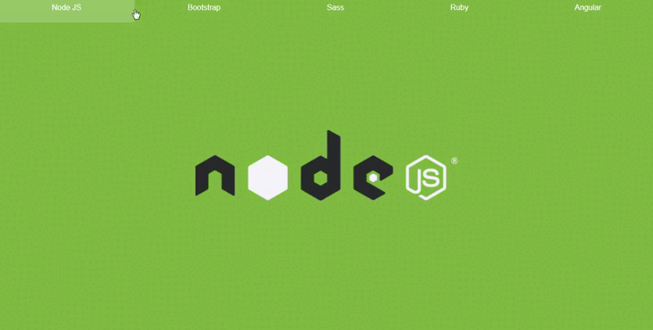

# One-Page-Navigation-with-Scroll-Effect
Foi utilizado apenas HTML e CSS para criar essa página com Navegação One-Page com efeito de rolagem.  Vídeo Aula disponível no Canal do Youtube: Sala de Estudo. 
Ao invés de utilizar uma lista não ordenada, o Menu de navegação foi criado com inputs do tipo radio buttons dos quais cada radio button é vinculado a uma respectiva label.

